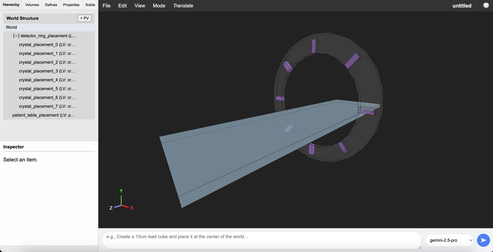

# virtual-pet

virtual-pet is a tool intended to assist users in creating and comparing geometries for positron emission tomography (PET) machines in Geant4. It is currently a web-based, AI-assisted visual editor for Geant4 GDML geometries. It provides an intuitive interface for creating, inspecting, and modifying complex geometries. The integrated AI assistant allows users to generate and place objects using natural language prompts. It was written with extensive assistance from Google Gemini LLMs.



## Installation

To run virtual-pet, you need a Python environment and a local instance of the Ollama AI service.

### 1. Prerequisites

-   [Python](https://www.python.org/downloads/) 3.9+
-   [Git](https://git-scm.com/)

### 2. Backend Setup (Python)

First, set up the Python server which handles all the geometry logic.

```bash
# 1. Clone the repository
git clone https://github.com/your-username/virtual-pet.git
cd virtual-pet

# 2. Install the required Python packages
pip install -r requirements.txt
```

### 3. AI Backend Setup (Ollama & Gemini)

GDML Studio can connect to two types of AI services simultaneously:
-   **Ollama:** For running open-source models locally on your machine.
-   **Google Gemini:** For using Google's powerful cloud-based models.

You can set up one or both.

#### Google Gemini (recommended)

Using Gemini models requires a free API key from Google.

1.  **Obtain an API Key:**
    -   Go to [Google AI Studio](https://aistudio.google.com/app/apikey).
    -   You may need to sign in with your Google account.
    -   Click the **"Create API key"** button.
    -   A new key will be generated. Copy this key immediately and store it somewhere safe.

2.  **Set the API Key in GDML Studio:**
    You can set your API key directly within the application.
    -   Run GDML Studio (see "Running the Application" below).
    -   In the top menu bar, go to **File -> Set Gemini API Key...**
    -   A dialog box will appear. Paste your copied API key into the input field.
    -   Click **"Save and Apply"**.

    The application will save your key to a local `.env` file in the project directory. This file is included in `.gitignore` and will not be tracked by version control, keeping your key secure. After saving, the AI model dropdown will automatically refresh to show the Gemini models available to you.

#### Ollama (for local models)

If you want to connect to an AI model run locally via Ollama:

1.  **Download and Install:** Get the Ollama application for your operating system from the official website: [https://ollama.com](https://ollama.com)
2.  **Pull a Model:** Open your terminal or command prompt and run the following command to download a model. This might take several minutes and a few gigabytes of disk space.
    ```bash
    ollama run gemma3:12b
    ```
3.  **Run in Background:** Make sure the Ollama application is running before you start the GDML Studio server.

## Running the Application

With your Python environment and at least one AI service (Ollama or Gemini) configured, you can now run the application.

1.  Make sure you are in the `gdml-studio` directory with your virtual environment activated.
2.  Start the Flask server:
    ```bash
    python app.py
    ```
3.  Open your web browser and navigate to: [http://localhost:5003](http://localhost:5003)

The web application should now be running. The AI model dropdown at the bottom-right will be populated with any available Ollama and/or Gemini models based on your setup.

## Usage

-   **File Menu:** Use the `File` menu to create a new project, open existing GDML/JSON projects, or save/export your work.
-   **Hierarchy Panels:** Use the tabs on the left to browse and select different components of your geometry. Double-click an item to open its editor.
-   **Inspector:** When an item is selected, its properties will appear in the Inspector panel on the bottom-left. For physical volumes, you can edit transforms directly or link them to defines.
-   **3D View:**
    -   **Observe Mode:** Left-click and drag to rotate, right-click and drag to pan, scroll wheel to zoom.
    -   **Translate/Rotate Modes:** Select a physical volume and use the gizmo to modify its position or rotation.
-   **AI Assistant:**
    1.  Type a descriptive prompt into the text box at the bottom right. For example: *"Create a detector made of a 20cm long tube of scintillator with a 5cm radius, and place with its axis along the z-axis at x=100,y=0."*
    2.  Click the "➤" (Generate) button.
    3.  The UI will show a loading state while the AI processes the request. Once complete, the new geometry will appear in the 3D view and hierarchy.
    Note that the accuracy and reliability of the AI will depend on what model you are using. It's likely that current