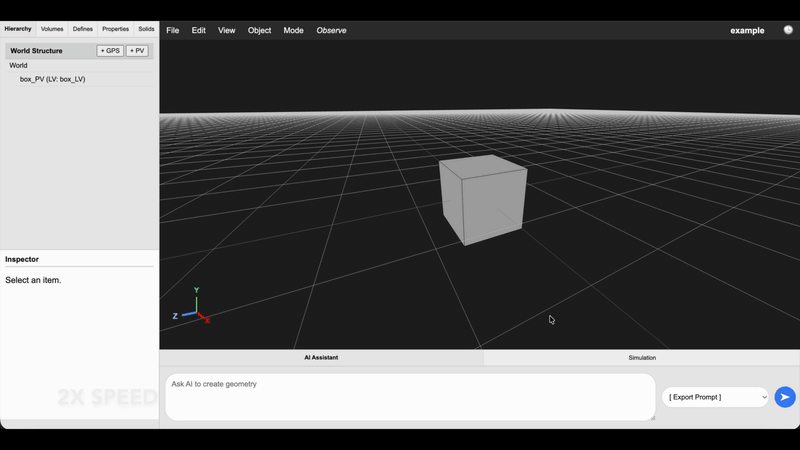

<div align="center" style="text-align: center;">
  
</div>

# airpet
AIRPET is a tool intended to assist users in creating and comparing geometries for positron emission tomography (PET) detectors in Geant4. It is currently a web-based, AI-assisted visual editor for Geant4 GDML geometries. It provides an intuitive interface for creating, inspecting, and modifying complex geometries. The integrated AI assistant allows users to generate and place objects using natural language prompts. It is a work in progress, so please feel free to contribute code and ideas!

<a href="https://huggingface.co/spaces/airpet/airpet" target="_blank" rel="noopener"></a>

*Click above to try out AIRPET! This initial version is hosted on limited resources, so please do not attempt to use it for production work. For large geometries and simulations, see instructions below for installing locally. Note that extensive testing of this code has not yet been performed, so use with caution. Please report any bugs or inconsistencies as an issue on this repository.*

<br>



## Installation

### 1. Prerequisites

-   [Python](https://www.python.org/downloads/) 3.9+
-   [Git](https://git-scm.com/)

### 2. Backend Setup (Python)

First, set up the Python server which handles all the geometry logic.

```bash
# 1. Clone the repository
git clone https://github.com/jerenner/airpet.git
cd airpet

# 2. Set up a Python 3.10 environment and install OpenCascade bindings
conda create --name airpet python=3.10
conda install -c conda-forge pythonocc-core

# 3. Install the required Python packages
pip install -r requirements.txt
```

### 3. AI Backend Setup (Ollama & Gemini)

Virtual PET can connect to two types of AI services simultaneously:
-   **Ollama:** For running open-source models locally on your machine.
-   **Google Gemini:** For using Google's cloud-based models.

#### Google Gemini (recommended)

Using Gemini models requires a free API key from Google.

1.  **Obtain an API Key:**
    -   Go to [Google AI Studio](https://aistudio.google.com/app/apikey).
    -   You may need to sign in with your Google account.
    -   Click the **"Create API key"** button.
    -   A new key will be generated.

2.  **Set the API Key in Virtual PET:**
    You can set your API key directly within the application.
    -   Run Virtual PET (see "Running the Application" below).
    -   In the top menu bar, go to **File -> Set Gemini API Key...**
    -   A dialog box will appear. Paste your copied API key into the input field.
    -   Click **"Save and Apply"**.

    The application will save your key to a local `.env` file in the project directory. This file is included in `.gitignore` and will not be tracked by version control. After saving, the AI model dropdown will automatically refresh to show the Gemini models available to you.

#### Ollama (for local models)

If you want to connect to an AI model run locally via Ollama:

1.  **Download and Install:** Get the Ollama application for your operating system from the official website: [https://ollama.com](https://ollama.com)
2.  **Pull a Model:** Open your terminal or command prompt and run the following command to download a model. This might take several minutes and a few gigabytes of disk space.
    ```bash
    ollama run gemma3:12b
    ```
3.  **Run in Background:** Make sure the Ollama application is running before you start the airpet server.

## Running the Application

With your Python environment and at least one AI service (Ollama or Gemini) configured, you can now run the application.

1.  Make sure you are in the `airpet` directory with your virtual environment activated.
2.  Start the Flask server:
    ```bash
    python app.py
    ```
3.  Open your web browser and navigate to: [http://localhost:5003](http://localhost:5003)

The web application should now be running. The AI model dropdown at the bottom-right will be populated with any available Ollama and/or Gemini models based on your setup.

## Compiling the Geant4 Application

To run simulations, you must compile the Geant4 application included in this repository.

### Prerequisites
- A working installation of **Geant4** (known to work with 11.3.2).
- **CMake** and **Make**.

### Compilation Steps

1.  **Source your Geant4 environment:**
    Depending on your installation, you need to source the `geant4.sh` script.
    ```bash
    source /path/to/geant4/bin/geant4.sh
    ```

2.  **Create a build directory:**
    Navigate to the `geant4` folder and create a `build` directory.
    ```bash
    cd geant4
    mkdir build
    cd build
    ```

3.  **Run CMake:**
    ```bash
    cmake ..
    ```

4.  **Compile:**
    ```bash
    make
    ```

5.  **Verify:**
    You should now see an executable named `airpet-sim` in the build directory.

## Contributions

Contributions are welcome! Please submit a pull request with any code contributions. By contributing, you agree to release your code under the MIT License.

## Acknowledgments

AIRPET integrates with several external tools and Python libraries for core functionality, including geometry editing, simulation, AI assistance, and reconstruction.

#### Simulation and reconstruction

- [Geant4](https://geant4.web.cern.ch/)
- [parallelproj](https://github.com/gschramm/parallelproj)

#### Python Dependencies

- [asteval](https://github.com/lmfit/asteval)
- [Flask](https://flask.palletsprojects.com/)
- [Flask-CORS](https://github.com/corydolphin/flask-cors)
- [NumPy](https://numpy.org/)
- [Ollama Python Client](https://github.com/ollama/ollama-python)
- [python-dotenv](https://github.com/theskumar/python-dotenv)
- [Google Generative AI SDK](https://github.com/googleapis/python-genai)
- [Gunicorn](https://gunicorn.org/)
- [SciPy](https://scipy.org/)
- [h5py](https://www.h5py.org/)
- [Pandas](https://pandas.pydata.org/)
- [Pillow](https://pillow.readthedocs.io/)

AIRPET uses the following open-source JavaScript libraries, loaded via CDNs for convenience. Local copies may be added in future releases for better reliability.

- [three.js](https://github.com/mrdoob/three.js) (core library + addons)
  - Core library loaded from: https://unpkg.com/three@0.160.0/build/three.module.js  
  - Addons loaded from: https://unpkg.com/three@0.160.0/examples/jsm/  

- [three-mesh-bvh](https://github.com/gkjohnson/three-mesh-bvh), loaded from https://unpkg.com/three-mesh-bvh@0.9.0/build/index.module.js  

- [three-bvh-csg](https://github.com/gkjohnson/three-bvh-csg), loaded from https://unpkg.com/three-bvh-csg@0.0.16/build/index.module.js  

For offline use, consider downloading local copies (e.g., via npm), bundling them in the `static/` folder, and updating paths in `templates/index.html` to reduce external dependencies.

The AIRPET code and this documentation was written with extensive assistance from Google Gemini LLMs, in particular Gemini 2.5 Pro and Gemini 3 Pro.

## Disclaimers

AIRPET is an open-source tool under active development and has not been formally verified or validated for accuracy, reliability, or safety. It is provided "as is" without any warranty, express or implied, including but not limited to the implied warranties of merchantability and fitness for a particular purpose. Some results may depend on underlying tools like Geant4 and parallelproj—users must independently verify simulations and reconstructions. This tool is intended for research and educational purposes only. It is NOT suitable for clinical, diagnostic, or medical decision-making. We make no claims regarding the accuracy of geometries, simulations, or reconstructions. Users assume all risks associated with its use.

**AI Integration:** AIRPET supports connections to AI models like Google Gemini or local Ollama instances. When using cloud-based models (e.g., Gemini), data (e.g., geometry prompts) may be transmitted to third-party servers. Review the provider's privacy policy (e.g., [Google AI Studio Privacy](https://ai.google.dev/terms)). No user data is stored by AIRPET itself.

As per the MIT License, the authors disclaim all liability for any damages arising from the use of this software.

<!-- ## Citation
If you use AIRPET in your work, please cite: -->

---
*Dummy change for testing GitHub workflow.*
